# Symflow Orders — Multi-Workflow Showcase

A runnable showcase for [`vandetho/symflow-laravel`](https://github.com/vandetho/symflow-laravel) that demonstrates **three concurrent workflows running on the same Eloquent model**:

1. **`order_lifecycle`** (state machine) — `cart → placed → shipped → delivered → completed`, plus cancel branches
2. **`order_payment`** (state machine) — `unpaid → authorized → captured → refunded`, plus `failed`/`retry`
3. **`order_fulfillment`** (Petri net) — `queued → [picking ∥ packing] → ready` (parallel pick + pack)

A single `Order` row holds three independent markings — one column per workflow — and the engine fires them entirely separately. The detail page renders one diagram + action panel per workflow, plus a combined audit timeline that color-codes each transition by which workflow it belongs to.

## What it demonstrates

| Engine feature | Where you see it |
|---|---|
| **Multiple workflows per model** | `Order::workflow($name)` resolves any of the three; each writes to its own column (`lifecycle` / `payment` / `fulfillment_marking`) |
| **State machine vs. Petri net side-by-side** | Lifecycle and payment use single-active-place state machines; fulfillment uses an AND-split that puts tokens in `picking` and `packing` simultaneously |
| **Shared guard evaluator** | One `RoleGuardEvaluator` instance applies across all three workflows |
| **Shared audit middleware with workflow disambiguation** | Single `order_audit_logs` table, `workflow_name` column captured from `SubjectMiddlewareContext->workflowName` |
| **Per-workflow event listeners** | `WorkflowEventType::Entered` listener fires for every workflow's transitions, log line tagged with the workflow name |
| **Status derivation across workflows** | `Order::status` accessor reads all three markings to produce a single headline status (e.g. `ready_to_ship` only when `lifecycle=placed` AND `fulfillment.ready=1`) |

## The three flows

### 1. `order_lifecycle` — state machine

```mermaid
flowchart LR
    cart([cart]) -->|"place&nbsp;&#40;role:customer&#41;"| placed[placed]
    cart -->|"cancel_cart&nbsp;&#40;role:customer&#41;"| cancelled([cancelled])
    placed -->|"ship&nbsp;&#40;role:warehouse&#41;"| shipped[shipped]
    placed -->|"cancel_placed&nbsp;&#40;role:manager&#41;"| cancelled
    shipped -->|"deliver&nbsp;&#40;role:warehouse&#41;"| delivered[delivered]
    delivered -->|complete| completed([completed])

    classDef good fill:#bbf7d0,stroke:#16a34a,color:#14532d;
    classDef bad fill:#fecdd3,stroke:#e11d48,color:#9f1239;
    class completed good;
    class cancelled bad;
```



### 2. `order_payment` — state machine

```mermaid
flowchart LR
    unpaid([unpaid]) -->|"authorize&nbsp;&#40;role:customer&#41;"| authorized[authorized]
    unpaid -->|fail| failed([failed])
    failed -->|"retry&nbsp;&#40;role:customer&#41;"| unpaid
    authorized -->|"capture&nbsp;&#40;role:finance&#41;"| captured[captured]
    captured -->|"refund&nbsp;&#40;role:finance&#41;"| refunded([refunded])

    classDef good fill:#bbf7d0,stroke:#16a34a,color:#14532d;
    classDef bad fill:#fecdd3,stroke:#e11d48,color:#9f1239;
    class captured good;
    class refunded,failed bad;
```



### 3. `order_fulfillment` — Petri net (parallel pick + pack)

```mermaid
flowchart LR
    queued([queued]) -->|"start_fulfillment&nbsp;&#40;role:warehouse&#41;"| picking[picking]
    queued -->|start_fulfillment| packing[packing]
    picking -->|"pick&nbsp;&#40;role:warehouse&#41;"| picked[picked]
    packing -->|"pack&nbsp;&#40;role:warehouse&#41;"| packed[packed]
    picked -->|"finalize&nbsp;&#40;role:warehouse&#41;"| ready([ready])
    packed -->|finalize| ready

    classDef good fill:#bbf7d0,stroke:#16a34a,color:#14532d;
    class ready good;
```



`start_fulfillment` puts a token in **both** `picking` and `packing` at once; `finalize` consumes one from each and produces a single token in `ready`. Pick and pack run in parallel — that's the AND-split / AND-join pattern Petri nets are made for.

## Run it locally

Requires **PHP 8.2+**, **Composer**, **Node 20+**, and a clone of [`symflow-laravel`](https://github.com/vandetho/symflow-laravel) sitting at `../symflow-laravel` (the package is consumed via a Composer **path repository**).

```bash
# 1. Clone both repos as siblings
git clone https://github.com/vandetho/symflow-laravel.git
git clone https://github.com/vandetho/symflow-laravel-order-lifecycle.git

# 2. Install
cd symflow-laravel-order-lifecycle
composer install
npm install

# 3. Configure
cp .env.example .env
php artisan key:generate
touch database/database.sqlite

# 4. Build database + frontend
php artisan migrate:fresh --seed
npm run build

# 5. Serve
php artisan serve
```

Open <http://localhost:8000> and use the **role switcher** in the top-right to sign in as a demo user.

> **Tip — live frontend reload:** in a second terminal run `npm run dev` instead of `npm run build` and Vite hot-reloads CSS/JS changes.

### Seeded users

| Role | Name | Email | Password |
|---|---|---|---|
| Customer | Ada Lovelace | `ada@orders.test` | `password` |
| Customer | Grace Hopper | `grace@orders.test` | `password` |
| Warehouse | Margaret Hamilton | `margaret@orders.test` | `password` |
| Finance | Marie Curie | `marie@orders.test` | `password` |
| Manager | Linus Torvalds | `linus@orders.test` | `password` |

### Seeded orders

| Reference | Lifecycle | Payment | Fulfillment | What it shows |
|---|---|---|---|---|
| ORD-1001 | cart | unpaid | queued | Empty state |
| ORD-1002 | placed | authorized | `picking, packed` | **Petri net mid-flight** — pick is still pending while pack is done |
| ORD-1003 | placed | authorized | ready | Fulfillment done, awaiting payment capture + ship |
| ORD-1004 | shipped | captured | ready | All three workflows past the midpoint |
| ORD-1005 | delivered | captured | ready | Customer has it |
| ORD-1006 | cancelled | failed | queued | Two workflows in terminal "negative" state |
| ORD-1007 | delivered | refunded | ready | Refund-after-delivery |

## The model holds three markings at once

```php
class Order extends Model
{
    use HasWorkflowTrait;

    protected function casts(): array
    {
        return [
            'fulfillment_marking' => 'array',  // Petri net — multiple active places
            // 'lifecycle' and 'payment' are plain string columns (state machines)
        ];
    }

    protected function getDefaultWorkflowName(): string
    {
        return 'order_lifecycle';   // used by HasWorkflowTrait when no name is passed
    }

    public function lifecycleWorkflow():    Workflow { return $this->workflow('order_lifecycle'); }
    public function paymentWorkflow():      Workflow { return $this->workflow('order_payment'); }
    public function fulfillmentWorkflow():  Workflow { return $this->workflow('order_fulfillment'); }
}
```

Firing transitions on each:

```php
$order = Order::find(1);

// Default workflow (order_lifecycle)
$order->applyTransition('place');                     // cart → placed
$order->applyTransition('ship');                      // placed → shipped

// Named workflow (state machine)
$order->applyTransition('authorize', 'order_payment'); // unpaid → authorized
$order->applyTransition('capture',   'order_payment'); // authorized → captured

// Named workflow (Petri net) — parallel branches
$order->applyTransition('start_fulfillment', 'order_fulfillment'); // queued → [picking, packing]
$order->applyTransition('pick',              'order_fulfillment');
$order->applyTransition('pack',              'order_fulfillment');
$order->applyTransition('finalize',          'order_fulfillment'); // [picked, packed] → ready
```

All three independent. The `Workflow::can()` check, the guard, the middleware, and the events all run separately for each — they don't even know about each other.

## Architecture

```
app/
├── Enums/Role.php                          # customer | warehouse | finance | manager
├── Models/
│   ├── Order.php                           # uses HasWorkflowTrait, three marking columns
│   └── OrderAuditLog.php                   # one table for all three workflows, workflow_name col
├── Workflow/
│   ├── RoleGuardEvaluator.php              # shared across all three workflows
│   ├── AuditLogMiddleware.php              # captures $context->workflowName so one table works
│   ├── WorkflowReasonContext.php           # request-scoped reason store
│   └── WorkflowDescriptor.php              # static metadata for UI (label, accent, etc.)
├── Providers/
│   └── WorkflowServiceProvider.php         # rebuilds the registry with the guard, attaches middleware to all three workflows in boot()
└── Livewire/
    ├── Components/
    │   ├── RoleSwitcher.php                # demo-mode "sign in as" dropdown
    │   ├── WorkflowDiagram.php             # Mermaid flowchart with active-place highlighting (per-accent palette)
    │   └── WorkflowSection.php             # one workflow's slice — diagram + grouped action panel + mini audit
    └── Pages/
        ├── Dashboard.php                   # table view, three columns of state pills per row
        └── OrderShow.php                   # header + 3× WorkflowSection + combined audit timeline
```

### Single audit table for all three workflows

```php
final readonly class AuditLogMiddleware
{
    public function __invoke(SubjectMiddlewareContext $context, Closure $next): Marking
    {
        $before = $context->marking->toArray();
        $after = $next();

        OrderAuditLog::query()->create([
            'order_id'       => $context->subject->getKey(),
            'actor_id'       => $this->auth->guard()->id(),
            'workflow_name'  => $context->workflowName,    // ← key: which workflow fired this
            'event'          => 'transition',
            'transition'     => $context->transition->name,
            'marking_before' => $before,
            'marking_after'  => $after->toArray(),
            'reason'         => WorkflowReasonContext::pull(),
            'occurred_at'    => now(),
        ]);

        return $after;
    }
}
```

Same middleware attached to all three workflows in the service provider's `boot()`, audit query filters by `workflow_name` for the per-section timelines.

## Edit visually on symflowbuilder.com

The repo ships three separate YAML files (one per workflow), each in Symfony's `framework.workflows` shape ready for symflowbuilder's import:

- [`workflow-lifecycle.yaml`](workflow-lifecycle.yaml)
- [`workflow-payment.yaml`](workflow-payment.yaml)
- [`workflow-fulfillment.yaml`](workflow-fulfillment.yaml)

Drop any of them into [symflowbuilder.com/editor](https://symflowbuilder.com/editor) → Import → YAML and the canvas fills in.

## Deploy free on Fly.io

Same pattern as the sibling demos — `Dockerfile` (FrankenPHP, multi-stage), `fly.toml` with a 1 GB persistent volume mounted at `/data`.

```bash
fly auth login
fly launch --no-deploy --copy-config
fly volumes create order_data --size 1
fly secrets set APP_KEY="base64:$(openssl rand -base64 32)"
fly deploy
```

The Dockerfile rewrites `composer.json` at build time to swap the local path repo for the published Packagist version of `vandetho/symflow-laravel`.

## Sibling demos

- [`symflow-laravel-expense-approval`](https://github.com/vandetho/symflow-laravel-expense-approval) — single Petri-net workflow with parallel legal + finance + manager review (AND-join via `finalize`).
- [`symflow-laravel-issue-tracker`](https://github.com/vandetho/symflow-laravel-issue-tracker) — single Petri-net workflow with parallel code-review + qa-review before merge.

This third demo is the one that shows **multiple workflows on the same model** — the pattern you'll reach for when an Order, Loan, Subscription, or Document needs more than one independent lifecycle to coexist.

## License

MIT.
